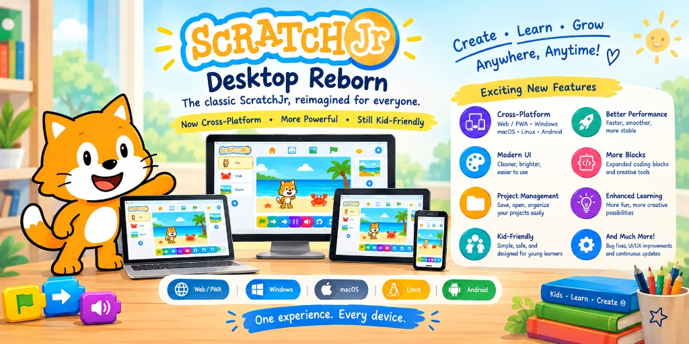

<p align="center">
  
</p>

# ScratchJr Reborn — Web/PWA, Desktop & Android

> A modernized, universal multi-platform edition of [ScratchJr](https://scratchjr.org/) for Web/PWA, Windows, macOS, Linux, and Android.

[](https://github.com/richiesamlie/ScratchJr-Desktop-Reborn/releases/latest)
[]()
[](LICENSE)
[]()

---

## 🚀 Launch Online & Downloads

| Platform | Target | Distribution |
| :--- | :--- | :--- |
| **🌐 Web / PWA** | In-Browser (Chrome, Safari, Edge, Firefox) | **[🎮 Launch Web App](https://richiesamlie.github.io/ScratchJr-Desktop-Reborn/play/)** · Installable PWA |
| **🪟 Windows** | Windows 10/11 (x64) | [Download MSI Installer](https://github.com/richiesamlie/ScratchJr-Desktop-Reborn/releases/latest) · [Portable ZIP](https://github.com/richiesamlie/ScratchJr-Desktop-Reborn/releases/latest) |
| **🍎 macOS** | Apple Silicon & Intel | [Download DMG / ZIP](https://github.com/richiesamlie/ScratchJr-Desktop-Reborn/releases/latest) |
| **🐧 Linux** | Ubuntu, Debian, Fedora (x64, ARM64) | [Download Tarball / ZIP](https://github.com/richiesamlie/ScratchJr-Desktop-Reborn/releases/latest) |
| **📱 Android** | Phones, Tablets, Chromebooks (Android 7.0+) | [Download APK](https://github.com/richiesamlie/ScratchJr-Desktop-Reborn/releases/latest) · Google Play Bundle |

---

## ✨ Key Capabilities

### 🌐 Universal Multi-Target Architecture
- **In-Browser Web & PWA**: Zero-install client-side execution via WebAssembly SQLite (`sql.js`) and IndexedDB with multi-tab concurrency guards.
- **Native Android Shell**: High-performance Kotlin shell with native SQLite WAL, camera/mic permissions, and system file intents.
- **Sandboxed Desktop**: Secure Electron runtime with strict context isolation, typed database intents, and silent MSI fleet deployment.

### 🎨 Creative Coding & Expanded Canvas
- **Advanced Paint Editor**: Discrete zoom controls (`+`, `−`, `1:1`), a true freehand masking eraser tool with circular preview cursor, multiple brush styles (Normal, Flat, Dotted), custom spectrum color picker, and star/line shape tools.
- **Sensing & Stage Detection**: New "If Touching Color" (`ontouchcolor`) Start block with color selector dropdown and interactive magnifying loupe eyedropper for pixel-level color sampling.
- **10 Pages per Project**: Expanded multi-scene storytelling with up to 10 pages per project (up from 4).
- **Enhanced Toolkit**: Horizontal flip (`flipX`) motion block, media & audio track import (`.wav`, `.mp3`, `.ogg`, `.webm`, `.m4a`), smart asset library search, and 12 native languages.

### ⚡ Modern Engine & Hardware Parity
- **Unified Pointer & Multi-Touch**: Responsive drawing and block dragging across touchscreens, stylus, and mouse with zero modality lock.
- **Interactive Camera**: Live camera feed capture with hardware fallback and keyboard shortcuts (`Space`/`Enter` to snap, `Escape` to cancel).
- **Streamlined Pipeline**: Direct single-roundtrip media transport and structured IPC cloning for fast asset loading and low memory usage.

### 💾 Safe Storage & 1-Click Sharing
- **1-Click `.sjr` Open & Export**: Dedicated lobby import card and instant export to native Save dialogs, Android share sheet, or browser download.
- **Self-Healing Asset Library**: Automatic SQLite repair and regeneration for custom sprite thumbnails.
- **Crash Protection**: Atomic database writes, rolling `.bak` snapshots on Desktop, and automated corruption quarantine.
- **209 Automated Tests**: 100% test coverage across database intents, shapes, blocks, UTF-8 serialization, camera controls, and CDP browser smoke harnesses.

---

## 🛠️ Building from Source

**Prerequisites:** Node.js 22+ and Git.

```bash
# Install dependencies
npm install

# Run unit tests and static analysis (209 tests, 0 errors)
npm test
npm run typecheck && npx eslint src

# Target Builds
npm run build:renderer     # Compile renderer TypeScript bundles
npm run build:web          # Build static Web / PWA to dist-web/
npm run build:android      # Sync web bundles to Android assets

# End-to-End Smoke Tests (CDP)
node scripts/smoke-web.js  # Headless browser test (PWA / Web)
node scripts/smoke-test.js # Electron desktop smoke test

# Desktop Packaging
npm run make:zip           # Build portable ZIP
npm run make               # Build platform installer (e.g. Windows MSI)
```

---

## 📚 Documentation

| Guide | Description |
| :--- | :--- |
| **[Architecture & Security](docs/ARCHITECTURE.md)** | Process separation, IPC boundaries, and data flows |
| **[Threat Model & Mitigations](docs/THREAT-MODEL.md)** | Security posture and network isolation |
| **[School & Fleet Deployment](docs/SCHOOL-DEPLOYMENT.md)** | MSI silent install flags, Intune, and GPO guides |
| **[Release Runbook](docs/RELEASE.md)** | Packaging procedures and maintainer release checklist |
| **[GitHub Wiki](https://github.com/richiesamlie/ScratchJr-Desktop-Reborn/wiki)** | Comprehensive guides, API docs, and platform runbooks |

---

## 🤝 Acknowledgements & Credits

ScratchJr Reborn builds upon the dedicated work of the open-source community:

- **Original ScratchJr**: Created by the [Tufts DevTech Research Group](https://sites.tufts.edu/devtech/), the [Lifelong Kindergarten group at MIT Media Lab](https://www.media.mit.edu/groups/lifelong-kindergarten/overview/), and the [Playful Invention Company](http://www.playfulinvention.com/). Official source: [`scratchfoundation/scratchjr`](https://github.com/scratchfoundation/scratchjr).
- **Desktop Electron Pioneers**: Initial desktop adaptations and WebRTC pointer/camera integration by [`jfo8000/ScratchJr-Desktop`](https://github.com/jfo8000/ScratchJr-Desktop) and [`JustSch/ScratchJr-Desktop`](https://github.com/JustSch/ScratchJr-Desktop).
- **Feature Inspirations**:
  - [`wangzongjun/ScratchJr`](https://github.com/wangzongjun/ScratchJr): Inspiration for the horizontal flip motion block (`flipX`), asset library categorization and search, 1-click `.sjr` import card, and UTF-8 Base64 serialization.
  - [`patdx/scratchjr`](https://github.com/patdx/scratchjr): Inspiration for web storage resilience architectures: multi-tab concurrency protection via the Web Locks API (`navigator.locks`), browser storage eviction defense (`navigator.storage.persist()`), and database corruption quarantine.
- **WebAssembly SQLite**: Powered by [SQL.js](https://github.com/sql-js/sql.js) and [SQLite.org](https://sqlite.org/).

---

## 📄 License & Disclaimer

Scratch and ScratchJr are trademarks of Massachusetts Institute of Technology, which does not sponsor, endorse, or authorize this content. See [scratchjr.org](https://scratchjr.org) for more information.

Licensed under the [BSD 3-Clause License](LICENSE) — Copyright (c) 2016, Massachusetts Institute of Technology.
