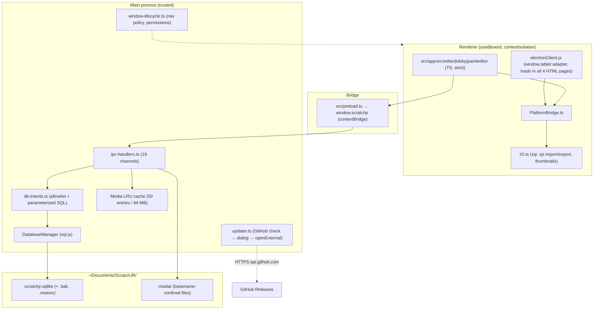

# Deep Engineering Audit — ScratchJr Desktop Reborn

Audit date: 2026-08-31 (based on handoff briefs dated 2026-08-30)
Repository: richiesamlie/ScratchJr-Desktop-Reborn @ `e20a97a` (v1.7.5)
Auditor method: full source read-through of the trust boundary, live toolchain
verification (Electron binary executed to read embedded versions), baseline
`npm test` / `typecheck` / `lint` / `npm audit` runs, and two parallel
sub-audits (CI/CD + renderer/media). Every finding below carries file:line
evidence from the current tree.

---

## 1. Executive summary

The application core is in materially better shape than a typical Electron
fork: sandboxed renderer with `contextIsolation`, structured DB intents with
strict allowlists (no renderer SQL), basename-confined media writes, atomic
(temp→rename) persistence with backup rotation and `PRAGMA integrity_check`
auto-recovery, a bounded LRU media cache, and a genuinely modular main process
(`main.ts` is a 151-line orchestrator; there is no god module).

The gaps are almost entirely on the **distribution side**, not in the app code:

- **Nothing is signed.** The `CSC_LINK`/`CSC_KEY_PASSWORD` env plumbing is
  dead wiring — `@electron/packager` v20 never reads those env vars, and no
  signer is ever invoked. Every published artifact (5 zips + MSI) is unsigned.
- **The MSI is broken as a fleet installer.** It is built with a *random
  UpgradeCode* per build (upgrades stack instead of replace), declares x86 for
  an x64 payload, and does not contain the `REMOVE_DATABASE` cleanup action
  that the README documents.
- **Release integrity rests on mutable tags.** All five GitHub Actions are
  tag-pinned (not SHA-pinned), including the third-party release publisher that
  runs with `contents: write`. The WiX 3.14 binary download is not checksum-
  verified.
- One stale build-target comment misdocuments the bundled Chromium by 16
  major versions (Electron 43 = Chromium 150, not 134).

Baseline health (all green at audit time): **143/143 unit tests**, typecheck
clean, lint clean, `npm audit`: **0 vulnerabilities**. Electron 43.4.1 is the
current release of a supported cycle (EOL 2027-01-05); Electron 44 exists but
no upgrade is warranted yet.

Top-priority actions (P0): SHA-pin CI actions, give the MSI a stable
UpgradeCode + x64 arch, wire real signing (or remove the dead plumbing), and
verify the WiX download. All are small, contained changes with clear tests.

---

## 2. Current architecture (verified from source)



Key verified facts:

- **Electron config** (`src/main/window-lifecycle.ts:58-63`):
  `nodeIntegration: false`, `contextIsolation: true`, `sandbox: true`, preload
  limited to `window.scratchjr`. Window-open denied (`:72`); only
  `media`/`mediaKeySystem` permissions granted (`:19,75-87`); navigation
  restricted to `src/app` via `will-navigate` containment check (`:90-112`).
- **CSP** on all four pages: `default-src 'self'; script-src 'self'; img-src
  'self' data:; …` (`src/app/index.html:10` and equivalents).
- **DB intents** (`src/lib/db-intents.ts:34-46`): 3-table/4-op allowlist,
  column allowlist for select items / where / order / insert / update,
  strict key-set validation (`unexpected key` errors), all values
  parameterized. `database_stmt` refuses non-write ops
  (`src/main/ipc-handlers.ts:206`), `database_query` refuses non-select
  (`:231`). No raw SQL path from the renderer exists.
- **Media writes**: filename always derived via `path.basename` equality
  check (`src/main/database.ts:358-363`), so traversal/zip-slip from `.sjr`
  entry names is neutralized (renderer also takes only the last path segment,
  `src/app/src/platform/IO.ts:528`).
- **Persistence**: every save is temp-write→rename with prior `.bak` rotation
  (`database.ts:192-216`); open-time `PRAGMA integrity_check` with
  backup-verified auto-recovery (`:113-117,149-169`); fresh-database
  fallback when both copies are corrupt; debounced saves with
  `flushPendingSave()` on close/crash (`:219-226,273-279`).
- **Updater** is notification-only (`src/main/main.ts:49-88`): GitHub API
  check with ETag 304 caching and 10s timeout (`src/main/updater.ts`),
  semver compare with prerelease-stripping, platform/arch asset selection,
  user-mediated download via `openExternal`. No auto-download, no
  auto-execute — appropriate for school fleets.
- **Outbound network**: exactly one destination — `api.github.com` update
  check 3s after launch (`src/main/main.ts:134-136`). No telemetry, no other
  fetches in main; renderer CSP blocks `connect-src` to self. Local-first
  claim holds.

### Dependency / runtime matrix (all versions verified live)

| Component | Version | Source | Notes |
|---|---|---|---|
| Electron | 43.4.1 | `package-lock.json`, binary executed | **Chromium 150.0.7871.224, V8 15.0, embedded Node 24.18.1** — verified by running `node_modules/electron/dist/electron.exe` and printing `process.versions` |
| esbuild target | `chrome134` | `scripts/build-renderer.js:26` | **Stale — 16 Chromium majors behind actual (150)**; comment "Electron 43 ships Chromium 134" is factually wrong |
| Node (build, CI) | 22 (workflow) / 26.6.0 (local) | `.github/workflows/build-release.yml:42` / `node -p process.version` | Two build environments; postinstall patch script exists mainly to bridge Forge 7.11.2 ↔ `@electron/packager` 20 hook skew, needed for local `make`, inert for CI release steps |
| Electron support status | cycle 43, EOL 2027-01-05 | endoflife.date/electron | Supported; 43.4.1 is the latest 43.x. Electron 44 (Chromium M152) released 2026-08-25 — no reason to rush |
| sql.js | 1.14.1 | lockfile | Runtime DB (WASM sqlite), 1 production dep |
| Electron Forge | 7.11.2 | lockfile | Packaging; CI actually uses `@electron/packager` 20.3.0 directly for release zips |
| electron-wix-msi | 5.1.3 | lockfile (transitive only) | **Phantom dependency** — required by `scripts/build-msi.js:39` but not declared in `package.json` |
| WiX toolset | 3.14.1 (EOL toolset) | `build-release.yml:125` | Downloaded at build time, no checksum verification |
| TypeScript / vitest | 7.0.2 / 4.1.10 | lockfile | Strict mode; 143 tests across 17 files |
| `@types/node` | ^26.2.0 vs CI Node 22 | `package.json:195` | Type/runtime skew (LOW) |
| npm audit | 0 vulnerabilities | `npm audit` run | Clean at audit date |

### Verification runs performed

| Check | Result |
|---|---|
| `npm test` (vitest) | **143/143 passed**, 17 files |
| `npm run typecheck` | clean |
| `npm run lint` | clean (exit 0) |
| `npm audit` | 0 vulnerabilities |
| Electron binary `process.versions` | chrome 150.0.7871.224 / node 24.18.1 / electron 43.4.1 |

---

## 3. Trust boundary assessment

```
UNTRUSTED                      Renderer (scripts, SVG text, .sjr bytes)
   │  contextBridge: window.scratchjr (19 typed methods, preload.ts:21-76)
   ▼
IPC (ipc-handlers.ts, 19 channels)      TRUSTED
   ├─ database_stmt/query ──► db-intents allowlist ──► sql.js (parameterized)
   ├─ io_setmedia/setmedianame ──► basename confinement ──► media/ files
   ├─ io_gettextresource/io_getAudioData ──► path-utils containment ──► app dir (read-only)
   ├─ io_remove/io_cleanassets ──► basename/extension-scoped deletes inside media/ only
   ├─ save-sjr-file / save-stage-png ──► native save dialog (user-mediated path)
   └─ debugWriteLog / app-closed-acked ──► logging / flush+close
```

Answers to the boundary questions from the audit spec:

- **Compromised renderer → arbitrary files?** No. All writes go through
  `saveToProjectFiles` (basename-confined) or user-mediated save dialogs.
  Reads outside `src/app` are blocked by `validateFilePath`
  (`src/lib/path-utils.ts:14-26`). No channel takes an absolute path.
- **Renderer → arbitrary SQL?** No. Only allowlisted intents compose SQL;
  values are parameterized; unknown keys/tables/columns/ops are rejected with
  distinct error codes (`db-intents.ts:94-165`, `ipc-handlers.ts:22-26`).
- **Malicious `.sjr` → FS escape?** No (basename + last-segment rules).
  But a malicious `.sjr` **can** corrupt the visible project state and hang
  the renderer via unclamped SVG dimensions (F-07, F-08).
- **Malicious SVG → code execution / network?** No code execution: SVG is
  parsed as XML via `DOMParser` (never executed), rasterized via a custom
  canvas pipeline that skips unknown tags (`SVG2Canvas.ts:377-379`), or
  displayed as `` data-URL where scripts/foreignObject are inert.
  External `xlink:href` fetch *attempts* exist in three code paths
  (`IO.ts:126-128`, `SVG2Canvas.ts:282-284`, `SVGImage.ts:187-189`) but are
  constrained by CSP `img-src 'self' data:` and canvas tainting blocks
  exfiltration. Residual risk: local-file existence probing (LOW, F-09).
- **Destructive IPC?** `io_remove` deletes a single media file by
  basename-confined name inside `media/` only. `io_cleanassets` deletes only
  files matching a given extension and not referenced by DB rows. Both are
  proportionate to a kids' app.

**Path containment & symlinks:** `path-utils` is lexical-only. The question
"can a symlink/junction escape containment?" resolves to: **renderer cannot
create symlinks** (no IPC channel creates links; only file writes via
`renameSync` of regular temp files). The threat requires a second local
actor writing symlinks into the user's own `Documents/ScratchJR` — outside
the threat model for this app. Verdict: lexical containment is sufficient
here; no realpath changes needed (and realpath would break the
"file does not exist yet" flows).

---

## 4. Findings

Severity: CRITICAL/HIGH/MEDIUM/LOW/INFO. Confidence: CONFIRMED (read the
code + ran the tool) / LIKELY / POSSIBLE / REQUIRES-VERIFICATION.

### F-01 — Release artifacts are unsigned (signing plumbing is dead wiring)

Severity: **HIGH** · Confidence: CONFIRMED

`build-release.yml:71-74` passes `CSC_LINK`/`CSC_KEY_PASSWORD` into the build,
and `package-and-zip.js:48-51` documents them in comments — but the options
object (`:32-52`) never sets `osxSign`/`windowsSign`. `@electron/packager`
v20 signs only when those options are present (its dist reads no `CSC_*` env
vars at all). `scripts/build-msi.js:41-52` passes no
`certificateFile`/`windowsSign` to `MSICreator` either. Net effect: even if
the secrets exist, **no signing step ever runs, on any platform, ever**.
School Windows machines get SmartScreen warnings; macOS Gatekeeper blocks
clean-machine installs.

Fix: wire `windowsSign`/`osxSign` (+ `@electron/notarize`) into the packager
options from env, and **fail the release when signing was requested but
skipped**. Until certificates exist, delete the dead env plumbing so nobody
believes releases are signed.

### F-02 — Published MSI has a random UpgradeCode → fleet upgrades stack installs

Severity: **HIGH** · Confidence: CONFIRMED (code path); artifact-level
REQUIRES-VERIFICATION (no published MSI was inspected)

The shipped MSI comes from `scripts/build-msi.js` (CI never runs Forge
`make`, so `forge.config.js`'s proper `upgradeCode`/x64/`beforeCreate`
wiring is **dead config** for releases). `build-msi.js` passes neither
`upgradeCode`, `arch`, nor `defaultInstallMode`, so `electron-wix-msi` v5
defaults apply: `upgradeCode = randomUUID()` and `arch = "x86"` per build.
Consequences for school fleets: installing v1.7.6 over v1.7.5 does **not**
upgrade — both versions coexist; MDM-driven upgrades silently duplicate.
Also: 64-bit payload declared x86; the README-documented
`REMOVE_DATABASE=1` uninstall cleanup (wired only via the unused Forge
path, `forge.config.js:34-46`) is absent from the shipped MSI.

Fix: pass `upgradeCode: '{E4346E7F-98B4-4602-9FAA-5AF8C9844BA7}'` (the GUID
already in `forge.config.js:32`), `arch: 'x64'`, and port the
`cleanup-action.wxs` injection into `build-msi.js`. Add an upgrade E2E
(v1→v2 same machine, assert single entry in Programs-and-Features).

### F-03 — CI actions pinned by mutable tags, incl. third-party publisher with write token

Severity: **HIGH** · Confidence: CONFIRMED

`build-release.yml:37,40,160,180,185` — `actions/*@v4` and
`softprops/action-gh-release@v2` are tag-pinned. Any of these tags being
repointed (or an account compromised) executes arbitrary code in the
pipeline that produces what schools install; the release job holds
`contents: write` (`:176-177`). No `github.event.*` interpolation into
`run:` exists (shell injection is clean — verified all `run:` blocks), so
this is the primary supply-chain exposure.

Fix: pin all five actions to full commit SHAs. One-line-each change, zero
runtime risk.

### F-04 — WiX 3.14 binaries downloaded at build time, unverified

Severity: **MEDIUM** · Confidence: CONFIRMED

`build-release.yml:124-127` curls `wix314-binaries.zip` from GitHub and runs
`candle.exe`/`light.exe` with no checksum verification. TLS protects the
transport but not a mutated upstream asset; WiX 3 is an archived/EOL
toolset whose assets could be replaced. The output MSI is the artifact
schools install.

Fix: `echo "<sha256> wix3.zip" | sha256sum -c -` before unzip (the workflow
already has this pattern for output artifacts at `:133-141`), or vendor WiX
in-repo.

### F-05 — esbuild target `chrome134` mismatches actual Chromium 150

Severity: **LOW** · Confidence: CONFIRMED (binary executed)

`scripts/build-renderer.js:26` targets `chrome134` with a comment claiming
"Electron 43 ships Chromium 134". Verified by running the installed Electron:
**Chromium 150.0.7871.224**. The mismatch is conservative (transpiling *down*
16 majors), so it is not a correctness bug — cost is unnecessary syntax
downgrading and slightly larger bundles. But the comment is factually wrong
and the hard-coded target will silently go stale again on the next Electron
bump.

Fix: derive the target from the installed Electron at build time
(`process.versions.chrome` from the electron package metadata, or a
`chrome${major}` computed in `build-renderer.js`), or bump to `chrome150`
with a corrected comment. Add a unit check asserting
target-major ≤ Electron's chrome-major.

### F-06 — Phantom dependency `electron-wix-msi`

Severity: **MEDIUM** · Confidence: CONFIRMED

`scripts/build-msi.js:39` requires `electron-wix-msi`, which is not in
`package.json`. It resolves today only as a hoisted transitive of
`@electron-forge/maker-wix`. Any dependency cleanup (e.g., dropping the
dead Forge WiX maker) breaks the Windows installer build with no `npm ci`
error. Fix: add to devDependencies.

### F-07 — .sjr import is non-transactional; project row committed before assets

Severity: **MEDIUM** · Confidence: CONFIRMED

`IO.ts:499-504` inserts the project row before extracting assets; the
`saveExpected`/`saveActual` counters (`IO.ts:465-466,521-637`) are incremented
but never compared (dead code). A crash or failed asset write mid-import
leaves a permanently broken project visible in the lobby on next launch
(no startup validation). Note the DB itself stays consistent (each
successful stmt persists via `savePending`), so this is a UX/integrity-of-
experience bug, not database corruption. Fix: compare the counters and delete
the staged project row on shortfall (or insert the row last).

### F-08 — Corrupt `.sjr` fails silently (sync catch around async call)

Severity: **MEDIUM** · Confidence: CONFIRMED

`PlatformBridge.ts:339-347` wraps `IO.loadProjectFromSjr` (async) in a
synchronous try/catch. A corrupt zip/JSON rejects the promise — the catch
never fires, the "Couldn't load share" Alert is dead code for the common
failure mode, and the user sees nothing. Fix: `.catch()` the promise and
route to the existing Alert.

### F-09 — Attacker-controlled SVG dimensions flow unclamped into canvas allocation

Severity: **MEDIUM** · Confidence: CONFIRMED

Imported SVG `width`/`height`/`viewBox` (custom import via `Library.ts`, or
`.sjr` character assets via `IO.ts:550-558`) reach
`IO.getThumbnail` → `setCanvasSize(Number(w), Number(h))`
(`IO.ts:55-56`) with no clamp. `viewBox="0 0 100000 100000"` allocates a
~40-billion-pixel canvas → renderer freeze/OOM on school hardware. Same
class: imported PNG/JPEG have no size/dimension/magic-byte checks and no
`img.onerror` (silent hang on decode failure). Fix: clamp dimensions (≤4096),
check `file.size`, add `onerror` handlers.

### F-10 — External `xlink:href` fetch attempts from imported SVG

Severity: **LOW** · Confidence: CONFIRMED (attempt path) / impact mitigated

Three paths assign raw `xlink:href` to `img.src` (`IO.ts:126-128`,
`SVG2Canvas.ts:282-284`, `SVGImage.ts:187-189`), permitting http/file
existence probes from imported content. CSP `img-src 'self' data:` blocks
http(s) on all pages; canvas taint blocks exfil. Residual: `file:` URL
probing on Windows where `'self'` is a `file://` origin —
REQUIRES-VERIFICATION. Fix: accept only `data:` hrefs at these sites.

### F-11 — `settings.json` packaged-version guard is vacuous

Severity: **LOW** · Confidence: CONFIRMED

`build-release.yml:109-118` looks for a loose `settings.json` under
`out/.../src/app/`, but the file lives inside `app.asar` after packaging, so
`find` returns nothing and the check silently passes without verifying
anything. (The v1.7.2 changelog claims this CI control exists.) The real
tag↔package.json check (`:48-58`) works. Fix: read via `@electron/asar` and
fail if not found.

### F-12 — macOS + Linux-arm64 artifacts ship without boot verification

Severity: **LOW** · Confidence: CONFIRMED

Smoke gate at `build-release.yml:144` excludes all darwin and arm64 runs;
CHANGELOG's "every release is now boot-verified" overstates coverage. Fix:
run the packaged smoke on macOS runners too.

### F-13 — Media directory grows unbounded; latent `mediaInUse` bug

Severity: **LOW** · Confidence: CONFIRMED

`cleanassets` is only ever invoked for `'wav'`/`'svg'`
(`ScratchJr.ts:375-377`), but imports generate thumbnail **PNGs** and
recordings are **webm** — both accumulate forever in
`Documents/ScratchJR/media`. Latent trap: `mediaInUse`
(`database.ts:282-308`) matches `MD5` columns only, not `ALTMD5`, so a
future `cleanassets('png')` would delete in-use thumbnails. Fix: clean
png/webm in the existing cycle + include ALTMD5 in the in-use check.

### F-14 — Engine bypasses its own ports seam

Severity: **LOW** · Confidence: CONFIRMED

`ports.ts:1-6` claims engine never imports platform/UI at runtime, but
`Sprite.ts:13-17`, `Page.ts:7-9`, `BlockSpecs.ts:2` runtime-import
`PlatformBridge`/`IO`/`MediaLib`/`SVGTools` directly. UI imports are
correctly type-only. This blocks headless-engine extraction (P3) but has no
runtime security impact. Fix: route through `EnginePorts` or amend the doc
claim.

### Positive findings (verified, no action needed)

- Zip-slip blocked at both layers (renderer last-segment rule + main
  basename guard) and unit-tested (`media-migration.test.js:96-103`).
- DB intents: allowlists + parameterization + strict key-set validation,
  10 unit tests.
- Atomic persistence + verified-backup auto-recovery + fresh-DB fallback;
  18 tests in `database-save.test.js`.
- Media cache bounded (50 entries/64 MB) with correct LRU accounting; 5 tests.
- `electronClient.js` (762 lines) is **active and required for boot** —
  loads in all 4 HTML pages, provides the `window.tablet` adapter. Not dead
  code; a TS-migration candidate only.
- Renderer debug seams (`window.__ioDebug`, `__modelRefs`) are inert given
  `script-src 'self'` CSP (INFO).
- No shell-injection vectors in any workflow `run:` block; secrets never
  echoed; tag↔version check fails closed.
- `npm audit` clean; runtime deps: 1 (`sql.js`).

---

## 5. Persistence failure matrix (spec §10)

| Scenario | Expected | Verified behavior | Verdict |
|---|---|---|---|
| Normal save | success | temp→rename with `.bak` rotation (`database.ts:192-216`) | OK |
| Crash during temp write | recovery on restart | `.tmp` orphan possible (not cleaned at boot); main file untouched | OK (cosmetic orphan) |
| Crash during rename | recovery | rename is atomic on NTFS/APFS/ext4; main file either old or new | OK |
| Disk full | no silent corruption | write fails → caught (`:211-215`), `.bak` intact; **error is swallowed (debugLog only)** — renderer never told | GAP (F-15, LOW) |
| Main DB corrupt | backup recovery | `integrity_check` on open → verified `.bak` → copy → reopen (`:113-169`); renderer notified via `databaseRestored` | OK |
| Backup also corrupt | safe failure | fresh empty DB (`:85-88`) — **old projects silently lost**, user dialog says "restored" only on success path | GAP (F-16, MEDIUM: silent data loss path) |
| Migration interrupted | retried next launch | per-row write→verify→drain, abort-on-failure, retried (`:234-270`) | OK |
| Save during shutdown | flushed | close handshake + `flushPendingSave()` + 10s force-quit fallback (`window-lifecycle.ts:117-134`, `main.ts:20-34`) | OK |
| Rapid saves | coalesced | debounce 100ms (`:219-226`) | OK |

Concurrent-modification answer: all DB writes are serialized on the single
main-process thread; `migrateMediaToDisk` runs only from `finishInit` before
handlers can race it (handlers check `db.isOpen()`), and `save()` is
synchronous. No two async writers can interleave on the same state. The one
real concurrency gap is renderer-side (F-07): the project row insert and the
asset writes are not one transaction from the user's perspective.

---

## 6. School deployment assessment (summary)

Full guide: `docs/SCHOOL-DEPLOYMENT.md` (new). Key facts verified from
packaging source:

- **MSI**: per-machine scope (`perMachine` default), silent `msiexec /qn`
  works, admin required — but broken upgrade chaining (F-02) makes fleet
  upgrades hazardous **today**. Fix F-02 before any 30/100/500-PC rollout.
- **Portable zips**: viable offline fallback; per-user data always in
  `Documents/ScratchJR` (no admin needed at runtime; standard users work).
- **Offline**: fully functional except the 3s GitHub update check, which
  fails silently by design. Can be blocked at the firewall without harm.
- **Rollback**: only manual (reinstall previous version) while F-02 is
  unfixed; afterwards downgrade-blocked by MSI rules by default.
- **Signing**: absent (F-01) — SmartScreen will friction every school
  install; distribution via MDM with hash-pinned URLs (sha256 sidecars
  exist) is the interim mitigation.

---

## 7. Performance & memory (measured where cheap)

- Renderer bundle: **21.9 MB total JS across 246 files**, but code-split;
  per-page payloads are the small `entry-*` chunks plus shared chunks.
  `minify: false` and full sourcemaps ship in production bundles —
  intentional for debuggability; costs disk/parse time. Defer until
  measured as a problem.
- No startup measurement was performed in this environment (headless CI
  box, no display) — **not claimed**. Recommend adding a cold-start timing
  budget to the packaged smoke test, which already boots the app.
- Memory: main-process media cache hard-bounded (50/64MB, tested);
  renderer-side image/canvas retention follows normal GC; no leak pattern
  found in `addEventListener`/timer audits beyond the media-dir growth
  (F-13, disk not RAM).
- Media migration yields to the event loop every 20 rows
  (`database.ts:259-261`) — startup-safe.

## 8. Testing gaps

Covered well: DB intents, persistence/backup, path containment, media
cache/migration, updater ETag/compare, preload bridge contract, project
duplication, golden editor flows.

Missing (ranked):

1. **MSI upgrade E2E** (v1→v2 same machine) — would have caught F-02.
2. **.sjr import failure mode** (corrupt zip → expect Alert) — would have
   caught F-08; also mid-import crash recovery (F-07).
3. **SVG dimension clamp** test (would have caught F-09 as a regression
   guard once fixed).
4. CI guard tests for workflow invariants (actions SHA-pinned, WiX checksum
   present) — cheap lint-style assertions.
5. E2E flows from the brief (fresh install → create → save → reopen →
   export/import) exist partially as smoke (`smoke-packaged.js`) but not as
   scripted multi-step journeys on all platforms (F-12 shows macOS untested).

## 9. Technical debt inventory

| Class | Items |
|---|---|
| Security debt | F-01 (signing), F-03/F-04 (CI pins/WiX), F-10 (xlink probes) |
| Distribution debt | F-02 (MSI identity), F-06 (phantom dep), F-12 (smoke gaps), dead `forge.config.js` makers never built in CI |
| Correctness debt | F-07/F-08 (.sjr import UX), F-11 (vacuous guard), F-15/F-16 (error surfacing) |
| Build debt | F-05 (stale target + comment), `@types/node` skew, two build environments (Node 22 CI / Node 26 local) |
| Architecture debt | F-14 (ports bypass), dead `saveExpected/saveActual` counters, `electronClient.js` still plain JS outside the bundle |
| Hygiene | `.DS_Store` files committed in repo; dist/ accumulation guarded only by postinstall rebuilds (fine in practice) |

Not debt: `patch-for-node26.js` postinstall mutation — auditable, idempotent,
self-repairing, and required only for local Forge runs; acceptable if
documented (it is).

## 10. Prioritized roadmap

| ID | Priority | Area | File(s) | Change | Test | Risk | Rollback |
|---|---|---|---|---|---|---|---|
| P0-001 | P0 | Supply chain | `.github/workflows/build-release.yml` | SHA-pin all 5 actions | CI green run | LOW | revert pins |
| P0-002 | P0 | Deployment | `scripts/build-msi.js` | Stable `upgradeCode`, `arch:'x64'`, inject cleanup action | MSI upgrade E2E on Windows runner | LOW | revert to defaults |
| P0-003 | P0 | Distribution | `scripts/package-and-zip.js`, `build-msi.js` | Wire real `windowsSign`/`osxSign` or delete dead CSC plumbing | signed-artifact verification step | MED (needs certs) | feature-flag by env |
| P0-004 | P0 | Supply chain | `build-release.yml:125` | Verify WiX zip SHA-256 before use | checksum step | LOW | remove check |
| P1-001 | P1 | Correctness | `src/app/src/platform/IO.ts`, `PlatformBridge.ts` | Compare import counters + `.catch` → Alert; stage project row last | corrupt-zip unit test | LOW | revert |
| P1-002 | P1 | Robustness | `IO.ts:55`, `Library.ts` | Clamp SVG/PNG dimensions; `onerror` handlers; size cap | dimension-clamp unit test | LOW | revert |
| P1-003 | P1 | Correctness | `database.ts` open-failure path | Surface "both DBs corrupt" to user dialog instead of silent fresh DB | failure-injection unit test | LOW | revert |
| P1-004 | P1 | Build | `scripts/build-renderer.js` | Derive esbuild target from Electron's chrome major; fix comment | build + unit assertion | LOW | hardcode `chrome150` |
| P1-005 | P1 | Supply chain | `package.json` | Declare `electron-wix-msi`; align `@types/node` to CI Node | `npm ci` + build | LOW | revert |
| P1-006 | P1 | CI | `build-release.yml:109-144` | Read settings.json via asar; extend smoke to macOS | CI run | LOW | revert |
| P2-001 | P2 | Hygiene | `src/main/database.ts` | Clean `.tmp` orphans at boot; disk-full error surfaced to renderer | unit test | LOW | revert |
| P2-002 | P2 | Storage | `ScratchJr.ts:375`, `database.ts` | Clean png/webm orphans; add ALTMD5 to `mediaInUse` | unit test | MED (deletion path — test first) | revert |
| P2-003 | P2 | Security | `IO.ts`, `SVG2Canvas.ts`, `SVGImage.ts` | Only accept `data:` xlink hrefs | unit test | LOW | revert |
| P2-004 | P2 | Docs | `docs/` | SCHOOL-DEPLOYMENT.md (done), RELEASE.md runbook | — | — | — |
| P3-001 | P3 | Architecture | `src/app/src/editor/engine/*` | Route platform imports through EnginePorts | existing suite | MED | revert |
| P3-002 | P3 | Runtime | `package.json` | Evaluate Electron 44 after its first patch line; no rush (43 supported to 2027-01) | full matrix | MED | restore lockfile |
| P3-003 | P3 | Renderer | `electronClient.js` | TS-migrate into the esbuild bundle | boot + smoke | MED | keep old file |

## 11. Final scorecard

| Area | Score | Confidence | Key reason |
|---|---:|---|---|
| Architecture | 8.5 | CONFIRMED | Modular main process, typed engine seam, no god modules |
| Electron security | 9.0 | CONFIRMED | Sandbox+isolation+CSP+nav policy+permission handlers all verified |
| IPC design | 8.5 | CONFIRMED | Allowlisted intents, basename confinement, user-mediated writes; naming is legacy-flat (cosmetic) |
| Database architecture | 9.0 | CONFIRMED | Allowlist SQL composition, atomic saves, verified recovery |
| Persistence/recovery | 8.5 | CONFIRMED | Strong; silent-fresh-DB path (F-16) and swallowed disk errors keep it from 9.5 |
| Media architecture | 8.0 | CONFIRMED | File-backed with bounded cache; unbounded png/webm growth (F-13) |
| Import/export (.sjr) | 7.0 | CONFIRMED | Zip-slip safe, but non-transactional + silent failure (F-07/F-08) |
| Updater | 8.0 | CONFIRMED | Notification-only, ETag-cached, rate-limit-aware; unsigned assets are the weakness (F-01) |
| CI/CD | 6.5 | CONFIRMED | Good gates (lint/test/typecheck/smoke/checksums), mutable pins + dead controls (F-03/F-11) |
| Supply chain | 6.5 | CONFIRMED | 1 runtime dep, audit clean; unverified WiX download, phantom dep, tag-pinned actions |
| Signing/release | 2.0 | CONFIRMED | Not implemented anywhere; plumbing is dead code |
| Windows deployment | 5.0 | CONFIRMED | MSI exists and is silent-installable but upgrade-broken (F-02), unsigned |
| macOS deployment | 5.0 | CONFIRMED | Builds ship, never boot-verified, unsigned/unnotarized |
| Linux deployment | 7.0 | CONFIRMED | x64 + arm64 zips built, smoke-tested on x64 only |
| School deployment readiness | 5.0 | CONFIRMED | Data model + silent install OK; upgrade/signing/offline-docs gaps block fleets |
| Performance | 7.5 | PARTIAL | Bounded caches and split bundles verified; no startup/memory measurements taken (stated, not guessed) |
| Testing | 8.0 | CONFIRMED | 143 focused tests on the right seams; no installer/import-failure E2E |
| Maintainability | 7.5 | CONFIRMED | Clear modules and docs; legacy naming, one plain-JS 762-line adapter |

**Overall: 7.3/10** — an unusually well-hardened app core whose release and
deployment infrastructure lags behind its runtime security posture. Fixing
the five P0 items is roughly a week of work and would raise the
distribution-side scores by multiple points each.
