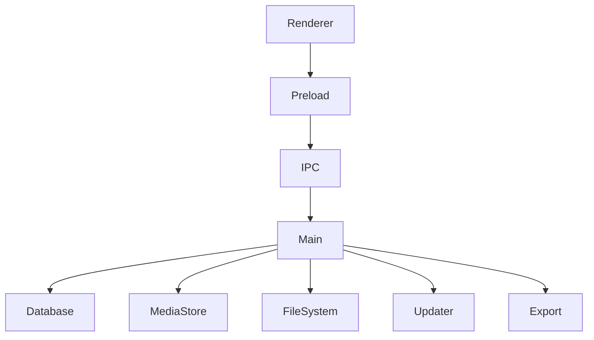
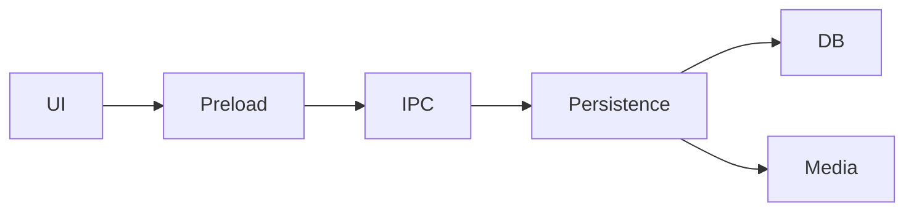

# ScratchJr Desktop Reborn — Deep Engineering Audit Specification

Repository:
https://github.com/richiesamlie/ScratchJr-Desktop-Reborn

Audit date:
2026-08-30

Document purpose:
This is an engineering-agent handoff specification for a **deep, evidence-based audit** of ScratchJr Desktop Reborn.

This is NOT a generic Electron security checklist and NOT a request for cosmetic refactoring.

The agent must inspect the actual repository, trace real execution/data flows, validate assumptions against installed dependency versions, run tests where possible, and produce concrete findings tied to files, symbols, and behavior.

---

# 0. Mission

Perform a deep engineering audit covering:

1. Software architecture
2. Electron security
3. IPC security and contracts
4. Renderer/main trust boundaries
5. Database architecture
6. Persistence and crash recovery
7. Filesystem security
8. Media pipeline
9. `.sjr` import/export
10. SVG/image/audio handling
11. Update mechanism
12. Supply-chain security
13. GitHub Actions / CI/CD
14. Packaging and signing
15. Windows/macOS/Linux behavior
16. School/fleet deployment
17. Performance and memory
18. Concurrency/race conditions
19. Error handling
20. Logging/observability
21. Test architecture
22. Dependency health
23. Maintainability
24. Upgrade strategy
25. Long-term architectural risks

Do not assume that a feature described in README.md is implemented correctly. Verify it in source code.

---

# 1. Required Audit Method

Use this sequence:

```text
Repository inventory
        ↓
Dependency inventory
        ↓
Architecture reconstruction
        ↓
Trust-boundary identification
        ↓
Data-flow tracing
        ↓
Security review
        ↓
Persistence/recovery review
        ↓
Cross-platform review
        ↓
CI/CD + supply-chain review
        ↓
Packaging/deployment review
        ↓
Performance review
        ↓
Testing-gap analysis
        ↓
Prioritized findings
        ↓
Implementation roadmap
```

Do not begin by changing code.

First establish the current state.

---

# 2. Evidence Standard

Every significant finding must contain:

- Severity
- Confidence
- File path
- Relevant symbol/function/class
- What the code currently does
- Why it matters
- Reproduction or reasoning
- Recommended fix
- Tests required
- Regression risk

Use:

```text
Severity:
CRITICAL
HIGH
MEDIUM
LOW
INFO
```

Use:

```text
Confidence:
CONFIRMED
LIKELY
POSSIBLE
REQUIRES-VERIFICATION
```

Do not call something HIGH or CRITICAL without concrete evidence.

---

# 3. Repository Inventory

Produce an inventory of:

```text
src/
scripts/
.github/
package.json
package-lock.json
forge configuration
TypeScript configuration
build configuration
test configuration
installer configuration
documentation
```

Identify:

- application entry points
- main process entry
- preload entry
- renderer entry
- build entry
- test entry
- packaging entry
- installer generation
- update logic
- persistence layer
- media layer
- import/export layer

Create a dependency/ownership map.

---

# 4. Dependency and Runtime Matrix

Determine exact versions from the repository, lockfile and build environment.

At minimum:

| Component | Exact version | Purpose | Runtime/build | Risk |
|---|---|---|---|---|
| Electron | verify | desktop runtime | runtime | |
| Node | verify | build/runtime distinction | build | |
| npm | verify | package manager | build | |
| esbuild | verify | renderer bundling | build | |
| Electron Forge | verify | packaging | build | |
| sql.js | verify | database | runtime | |
| TypeScript | verify | compilation | build | |
| WiX | verify | Windows MSI | build | |

Important:

Do not confuse:

```text
Node used by GitHub Actions
```

with:

```text
Node embedded in Electron
```

They are different runtime environments.

---

# 5. Electron Runtime Audit

Verify:

- `nodeIntegration`
- `contextIsolation`
- `sandbox`
- preload loading
- renderer origins
- navigation restrictions
- window opening restrictions
- external URL handling
- `webSecurity`
- CSP
- permissions
- protocol handlers
- custom schemes
- file:// usage
- devtools exposure
- production/dev differences

Check all `BrowserWindow` instances, not just the primary one.

For each window record:

```text
Window
 ├── preload
 ├── URL/loadFile
 ├── webPreferences
 ├── navigation policy
 ├── external navigation policy
 └── IPC exposure
```

---

# 6. Renderer ↔ Main Trust Boundary

Draw the real trust boundary:

```text
UNTRUSTED / LESS TRUSTED
        Renderer
           │
           ▼
      contextBridge
           │
           ▼
          IPC
           │
           ▼
TRUSTED / PRIVILEGED
       Main process
           │
     ┌─────┴─────┐
     ▼           ▼
Filesystem    Database
```

For every boundary ask:

1. What data crosses?
2. Who controls it?
3. What validation occurs?
4. What privilege is gained?
5. What happens if validation fails?
6. Is the error safe?
7. Can the renderer cause excessive work?
8. Can malformed input crash the main process?

---

# 7. IPC Deep Audit

Inventory every IPC channel.

Create a table:

| Channel | Direction | Input | Output | Privilege | Validation | Risk |
|---|---|---|---|---|---|---|

Audit for:

- arbitrary SQL
- arbitrary filesystem paths
- arbitrary deletion
- arbitrary writes
- arbitrary reads
- oversized payloads
- malformed objects
- prototype pollution
- type confusion
- missing bounds
- unhandled exceptions
- renderer-controlled operations
- unsafe external URL opening

Do not accept "the renderer is trusted" as a mitigation.

The renderer should be treated as a compromised client from the main process's perspective.

---

# 8. Database Intent Security

The repository contains a structured DB-intent mechanism.

Audit:

```text
op
table
items
where
order
row
id
```

Verify:

- table allowlist
- column allowlist
- operation allowlist
- primitive-value validation
- parameterized values
- SQL identifier construction
- update/delete targeting
- null handling
- malformed object handling
- unexpected keys
- prototype edge cases
- resource exhaustion

Important:

Parameterized values do NOT protect SQL identifiers.

Therefore verify every dynamic:

```text
table
column
ORDER BY column
direction
```

is allowlisted.

---

# 9. Database Correctness

Inspect:

```text
database.ts
data-store.ts
migrations
schema initialization
backup/recovery
```

Audit:

- schema initialization
- migrations
- migration ordering
- migration idempotency
- transaction boundaries
- save sequencing
- database close behavior
- concurrent writes
- temporary DB files
- rename semantics
- backup creation
- backup replacement
- corruption detection

---

# 10. Persistence Failure Matrix

Test or reason through:

| Scenario | Expected result | Actual result | Risk |
|---|---|---|---|
| Normal save | success | | |
| Crash during temp write | recovery | | |
| Crash during rename | recovery | | |
| Disk full | no silent corruption | | |
| Permission denied | useful error | | |
| Main DB corrupt | backup recovery | | |
| Backup corrupt | safe failure | | |
| Both corrupt | safe failure | | |
| Migration interrupted | recoverable | | |
| Save during shutdown | flushed | | |
| Multiple saves rapidly | serialized/coalesced | | |

Particularly test:

```text
write temp
   ↓
process killed
   ↓
restart
```

and:

```text
backup update
   ↓
process killed
   ↓
restart
```

---

# 11. Atomicity and Concurrency

Look for race conditions involving:

- debounced saves
- immediate shutdown saves
- multiple save calls
- database initialization
- migration
- media migration
- cache updates
- project duplication
- import/export
- cleanup

Determine whether operations can overlap.

Explicitly answer:

> Can two asynchronous operations modify the same persistent state concurrently?

If yes:

- identify the race
- identify consequences
- recommend serialization/locking where necessary

---

# 12. Filesystem Security

Audit every filesystem API.

Search for:

```text
readFile
writeFile
unlink
rm
rename
copyFile
mkdir
readdir
stat
realpath
open
createReadStream
createWriteStream
```

For every operation determine:

```text
input path
base directory
validation
canonicalization
symlink behavior
permissions
extension restrictions
```

Test:

```text
../
../../
absolute paths
Windows drive paths
UNC paths
mixed separators
symlinks
junctions
case changes
nonexistent targets
```

Important:

Lexical containment and filesystem containment are not always identical.

Investigate symlink/junction/reparse-point escape scenarios.

---

# 13. Media Import Security

Audit:

- PNG
- JPEG
- SVG
- audio
- thumbnails
- imported project assets

Questions:

1. Is file type based only on extension?
2. Is MIME/signature checked?
3. Are files size-limited?
4. Are dimensions bounded?
5. Can an attacker import a huge image?
6. Can an attacker import malicious SVG?
7. Is SVG sanitized?
8. Are external SVG references possible?
9. Can imported media escape the media directory?
10. Can imported media overwrite another asset?
11. Can duplicate filenames cause collisions?

Treat imported media as untrusted.

---

# 14. SVG-Specific Review

SVG is especially important.

Determine whether imported SVG can contain:

```text
<script>
foreignObject
external references
event handlers
embedded URLs
external images
CSS
SMIL
```

Determine how SVG is rendered.

If SVG is converted/wrapped, verify that this does not create a new injection vector.

Do not assume "SVG inside Electron" is safe by default.

---

# 15. `.sjr` Import/Export Audit

Trace the entire path:

```text
.sjr
 ↓
parse
 ↓
validate
 ↓
extract assets
 ↓
deduplicate
 ↓
write database
 ↓
write media
 ↓
update UI
```

Audit for:

- malformed archive/project data
- path traversal
- zip bombs
- oversized assets
- duplicate IDs
- duplicate filenames
- invalid JSON
- unexpected fields
- corrupted media
- partial import
- rollback
- interrupted import
- malicious metadata

The import operation should be transactional from the user's perspective.

Ask:

> What happens if the process crashes halfway through importing a project?

---

# 16. Project Duplication / Remix

Audit:

```text
duplicate project
copy project metadata
copy pages
copy sprites
copy scripts
copy media
```

Verify:

- unique IDs
- no shared mutable state
- no accidental source-project modification
- media deduplication
- failure rollback

---

# 17. Model Registry / Engine Separation

The repository replaces legacy DOM expandos with a model registry and separates the engine through `EnginePorts`.

Audit whether the architecture really achieves:

```text
Engine
   ↓
typed EnginePorts
   ↓
platform/UI implementation
```

Search for hidden coupling:

- global singletons
- direct DOM access from engine
- UI imports from engine
- platform imports from engine
- circular dependencies
- mutable global state

Produce an actual dependency graph.

---

# 18. Renderer Bundle Architecture

Inspect:

```text
scripts/build-renderer.js
dynamic imports
code splitting
shared chunks
```

Verify:

- actual bundle sizes
- unnecessary shared dependencies
- page-specific loading
- source maps in production
- dev/prod differences
- tree shaking
- renderer startup cost

Investigate the current Chromium/esbuild target carefully.

Do not trust stale comments.

---

# 19. Build Target Verification

Explicitly verify:

```text
package.json Electron version
        ↓
Electron embedded Chromium version
        ↓
esbuild target
        ↓
actual supported JS/CSS features
```

If there is a mismatch, report:

```text
Current
Expected
Impact
Fix
```

Do not blindly upgrade or downgrade the target.

---

# 20. Update System

Inspect updater implementation.

Audit:

- release discovery
- ETag caching
- rate limits
- timeout handling
- malformed responses
- version comparison
- prereleases
- platform asset selection
- architecture asset selection
- redirects
- HTTPS
- external URL handling
- asset authenticity
- checksum/signature validation
- download behavior

Determine whether it is:

```text
notification-only
```

or:

```text
true auto-update
```

and whether that is appropriate for school deployment.

---

# 21. Supply-Chain Security

Audit:

```text
package-lock.json
npm dependencies
GitHub Actions
third-party Actions
release Actions
downloaded build tools
signing tools
installer tools
```

Pay special attention to CI steps that download binaries at build time.

For each third-party action:

```text
action
version
pinned commit?
permissions
trust
network access
secrets access
```

Prefer immutable SHA pinning for security-sensitive actions where practical.

---

# 22. GitHub Actions Audit

Inspect every workflow.

Check:

- permissions
- token scope
- pull-request behavior
- tag behavior
- fork behavior
- secret exposure
- shell injection
- artifact handling
- cache poisoning
- untrusted inputs
- branch protection assumptions
- action versions
- release permissions

Look for dangerous patterns such as:

```yaml
run: echo "${{ github.event... }}"
```

when values can be attacker-controlled.

---

# 23. Release Pipeline

Trace:

```text
git tag
 ↓
GitHub Actions
 ↓
checkout
 ↓
npm ci
 ↓
test
 ↓
build
 ↓
package
 ↓
sign
 ↓
checksum
 ↓
artifact
 ↓
release
```

For each step identify trust boundaries and failure modes.

Verify:

- tag/package version consistency
- artifact naming
- artifact contents
- architecture correctness
- checksums
- signing
- release metadata
- release notes
- accidental debug builds
- source maps
- secrets

---

# 24. Code Signing

Verify actual implementation, not just environment variables.

Windows:

```text
MSI signed?
EXE signed?
timestamped?
certificate valid?
```

macOS:

```text
app signed?
installer signed?
notarized?
stapled?
Gatekeeper clean-machine test?
```

Document the current state as:

```text
implemented
partially implemented
configured but unused
not implemented
unknown
```

---

# 25. Windows MSI Audit

Inspect installer generation.

Verify:

- install scope
- silent install
- silent uninstall
- upgrade behavior
- downgrade behavior
- registry entries
- shortcuts
- file associations
- uninstaller
- user-data preservation
- `REMOVE_DATABASE=1`
- permissions
- Program Files behavior
- standard-user behavior

Test:

```text
v1 install
 ↓
v2 upgrade
 ↓
projects remain
```

and:

```text
uninstall
 ↓
reinstall
 ↓
expected data behavior
```

---

# 26. macOS Audit

Verify:

- Intel
- Apple Silicon
- application bundle
- signing
- notarization
- Gatekeeper
- quarantine
- user data path
- permissions
- update behavior

---

# 27. Linux Audit

Verify:

- x64
- ARM64
- sandbox behavior
- X11/Wayland behavior
- audio
- filesystem permissions
- desktop integration
- dependencies
- headless smoke-test assumptions

---

# 28. School Fleet Deployment

Assume:

```text
30 PCs
100 PCs
500 PCs
```

and limited technical support.

Design/assess:

```text
School IT
    |
    +-- MSI / deployment package
    |
    +-- approved version
    |
    +-- offline installer
    |
    +-- rollback
    |
    +-- silent install
    |
    +-- silent uninstall
    |
    +-- data preservation
```

Investigate:

- Microsoft Intune
- Group Policy
- software distribution tools
- proxy environments
- firewall restrictions
- no-admin user accounts
- shared PCs
- lab PCs
- roaming users
- local-only operation

Do not require cloud infrastructure unless there is a concrete need.

---

# 29. Privacy / Child-Safety Architecture

Because this software is intended for children/schools:

Audit for:

- telemetry
- analytics
- network requests
- crash reporting
- update checks
- remote content
- external URLs
- student-identifying data
- hidden network dependencies

Inventory all outbound network destinations.

Expected principle:

```text
local-first
minimal network dependency
minimal telemetry
no unnecessary student data
```

---

# 30. Network Audit

Search for every:

```text
fetch()
XMLHttpRequest
WebSocket
net.request
https
http
shell.openExternal
```

Create:

| Destination | Purpose | Required? | Data sent | Risk |
|---|---|---|---|---|

Particularly inspect:

- GitHub API
- release URLs
- external assets
- help pages
- remote images
- external links

---

# 31. Performance Audit

Measure where possible.

Record:

```text
Cold startup
Warm startup
Lobby load
Editor load
Project open
Project save
Project duplication
Media import
`.sjr` import
`.sjr` export
Stage PNG export
```

Also:

```text
RAM at launch
RAM after 10 min
RAM after 30 min
RAM after opening many projects
RAM after importing many images
```

CPU:

```text
idle
animation
paint editor
large project
```

Do not claim performance problems without measurements or strong code evidence.

---

# 32. Memory Leak Audit

Inspect:

- event listeners
- DOM references
- model registry
- WeakMap usage
- timers
- intervals
- IPC listeners
- BrowserWindow lifecycle
- image caches
- audio resources
- canvas
- Blob URLs
- object URLs

Look for:

```text
addEventListener
setInterval
setTimeout
ipcRenderer.on
ipcMain.on
URL.createObjectURL
```

and verify corresponding cleanup.

---

# 33. Cache Audit

For every cache verify:

- maximum entries
- maximum bytes
- eviction
- invalidation
- stale data
- memory growth
- corrupted cache behavior
- shutdown behavior

A cache must never become an accidental persistent database.

---

# 34. Error Handling

Audit every major async boundary.

Look for:

```text
catch
Promise rejection
IPC handler errors
filesystem errors
database errors
migration errors
import errors
export errors
network errors
```

Determine whether errors:

```text
are logged
are surfaced
are swallowed
can crash the app
can leave partial state
```

Avoid exposing sensitive internal paths or stack traces to users.

---

# 35. Logging / Observability

Review:

- debug logging
- production logging
- log location
- log rotation
- sensitive data
- project content leakage
- personally identifiable data
- error context

Recommend structured logging if current logging is insufficient.

Do not add remote telemetry without an explicit privacy requirement.

---

# 36. Test Architecture

Inventory all tests.

Categorize:

```text
Unit
Integration
E2E
Smoke
Packaging
Cross-platform
```

Map tests to architecture.

Find untested boundaries.

Priority E2E flows:

```text
fresh install
first launch
create project
save
close
reopen
edit
undo
redo
duplicate
import
export
media import
migration
corrupt DB recovery
upgrade
uninstall
reinstall
```

---

# 37. Failure Injection

Where practical, introduce controlled failure tests for:

```text
disk full
permission denied
corrupt DB
corrupt backup
interrupted migration
interrupted import
network unavailable
GitHub API 403
GitHub API 500
malformed JSON
missing asset
invalid media
large media
```

The goal is to verify graceful degradation.

---

# 38. Threat Model

Produce a threat model containing at least:

### Threat A — Malicious `.sjr`

```text
Attacker
  ↓
malicious .sjr
  ↓
import parser
  ↓
asset extraction
  ↓
filesystem
```

### Threat B — Malicious media

```text
Attacker
  ↓
SVG/image/audio
  ↓
media import
  ↓
renderer
```

### Threat C — Compromised renderer

```text
Renderer
  ↓
IPC
  ↓
main process
  ↓
filesystem/database
```

### Threat D — Malicious update metadata

```text
GitHub/API
  ↓
release metadata
  ↓
updater
  ↓
user
```

### Threat E — CI supply-chain compromise

```text
dependency/action/tool
  ↓
GitHub Actions
  ↓
release artifact
  ↓
school PC
```

For each:

```text
Likelihood
Impact
Current mitigation
Remaining risk
Recommended mitigation
```

---

# 39. Architecture Quality Review

Evaluate:

## Separation of concerns

Can these evolve independently?

```text
UI
Engine
Platform
Persistence
Media
Updater
Packaging
```

## Dependency direction

Prefer:

```text
UI
 ↓
application interfaces
 ↓
platform/storage implementations
```

Avoid:

```text
engine → UI singleton
storage → renderer
renderer → Node
```

## Coupling

Identify:

- global state
- circular dependencies
- god modules
- god interfaces
- duplicated abstractions
- dead code
- compatibility aliases

---

# 40. IPC Architecture Refactoring Assessment

Evaluate whether low-level IPC functions should become domain-oriented APIs:

```text
window.scratchjr.projects
window.scratchjr.media
window.scratchjr.database
window.scratchjr.export
window.scratchjr.system
```

Do NOT perform this refactor solely for aesthetics.

First provide:

```text
current problem
evidence
benefit
migration strategy
regression risk
```

---

# 41. Storage Architecture Refactoring Assessment

Evaluate whether the application should expose:

```text
ProjectStore
MediaStore
DatabaseStore
```

rather than allowing higher layers to know database implementation details.

Potential target:

```text
Application
   |
   +-- ProjectStore
   |
   +-- MediaStore
   |
   +-- SettingsStore
           |
           v
      persistence layer
```

Again, do not refactor unless justified.

---

# 42. Upgrade Strategy

Evaluate current Electron version against currently supported Electron releases.

Do not upgrade automatically.

Create a compatibility plan:

```text
Current Electron
      ↓
target Electron
      ↓
Chromium changes
      ↓
Node changes
      ↓
API changes
      ↓
ScratchJr compatibility
      ↓
packaging
      ↓
signing
      ↓
E2E
```

Recommend the target version only after testing implications.

---

# 43. Technical Debt Inventory

Classify:

```text
Security debt
Architecture debt
Build debt
Testing debt
Documentation debt
Deployment debt
Performance debt
Compatibility debt
```

Do not mix "old-looking code" with actual technical debt.

Technical debt requires a measurable maintenance or risk cost.

---

# 44. Final Scorecard

Provide scores from 0–10:

| Area | Score | Confidence | Key reason |
|---|---:|---|---|
| Architecture | | | |
| Electron security | | | |
| IPC | | | |
| Database | | | |
| Persistence | | | |
| Media | | | |
| Import/export | | | |
| CI/CD | | | |
| Supply chain | | | |
| Signing | | | |
| Windows deployment | | | |
| macOS deployment | | | |
| Linux deployment | | | |
| Performance | | | |
| Testing | | | |
| Maintainability | | | |
| School deployment | | | |

---

# 45. Findings Format

Every confirmed issue should use:

```markdown
## [P0-001] Short finding title

Severity: CRITICAL
Confidence: CONFIRMED

### Location

`src/example/file.ts:123`

### Symbol

`exampleFunction()`

### Current behavior

Describe exactly what happens.

### Why this matters

Describe technical/security/operational impact.

### Evidence

Quote only the minimum code necessary or describe the exact logic.

### Reproduction

Provide a safe reproduction or reasoning path.

### Recommended fix

Describe the smallest robust fix.

### Tests

List tests required.

### Regression risk

LOW / MEDIUM / HIGH

### Rollback

Explain how the change can be reverted safely.
```

---

# 46. Prioritization

Use:

## P0

Immediate correctness/security issue.

Examples:

```text
arbitrary code execution
arbitrary filesystem access
data corruption
release artifact compromise
critical signing failure
```

## P1

Production/fleet blocker or significant security/operational risk.

## P2

Important maintainability/reliability improvement.

## P3

Optimization/future architecture.

---

# 47. Required Deliverables

The agent should produce:

```text
docs/DEEP-ENGINEERING-AUDIT.md
docs/ARCHITECTURE.md
docs/THREAT-MODEL.md
docs/SCHOOL-DEPLOYMENT.md
```

If appropriate, also:

```text
docs/IPC.md
docs/RELEASE.md
docs/DATA-RECOVERY.md
```

Do not create documentation files merely to increase file count. Each should contain useful, verified information.

---

# 48. Mermaid Architecture Diagram

Produce a real architecture diagram based on source inspection.

Minimum form:



Expand it to reflect the actual repository.

---

# 49. Data-Flow Diagram

Produce at least:



Also produce a project import flow:

```text
.sjr
 ↓
parse
 ↓
validate
 ↓
extract
 ↓
deduplicate
 ↓
persist
 ↓
render
```

---

# 50. Do Not Do These Things

Do NOT:

- rewrite large parts of the application without evidence
- upgrade Electron blindly
- replace sql.js just because another DB exists
- add a cloud backend without a requirement
- add telemetry without a privacy decision
- disable sandboxing for convenience
- expose raw IPC
- expose raw SQL
- weaken path validation
- remove backups
- remove integrity checks
- remove checksums
- replace allowlists with deny-lists
- add auto-update silently
- assume Linux behavior matches Windows
- assume development configuration matches production
- trust README claims without source verification

---

# 51. Recommended Final Report Structure

The final audit should be:

```text
1. Executive summary

2. Current architecture

3. Architecture diagram

4. Trust boundaries

5. Dependency/runtime matrix

6. Security findings

7. IPC findings

8. Database findings

9. Persistence/recovery findings

10. Filesystem findings

11. Media/SVG findings

12. .sjr import/export findings

13. Updater findings

14. CI/CD findings

15. Supply-chain findings

16. Signing/release findings

17. Cross-platform findings

18. School deployment findings

19. Performance findings

20. Testing gaps

21. Technical debt

22. P0/P1/P2/P3 roadmap

23. Recommended architecture

24. Implementation plan

25. Final scorecard
```

---

# 52. Implementation Roadmap Template

For each proposed implementation:

| ID | Priority | Area | File(s) | Change | Tests | Risk | Rollback |
|---|---|---|---|---|---|---|---|
| P0-001 | P0 | Security | | | | | |
| P0-002 | P0 | Build | | | | | |
| P1-001 | P1 | Deployment | | | | | |
| P2-001 | P2 | Architecture | | | | | |

---

# 53. Special Initial Investigation Targets

The following areas deserve explicit verification because an initial review identified them as potentially important:

## A. Renderer build target

`scripts/build-renderer.js`

Current code reportedly targets:

```js
target: ['chrome134']
```

Verify this against the exact Electron/Chromium version.

Do not rely on comments.

---

## B. Electron version

`package.json`

Verify:

- exact version
- lockfile resolution
- supported Chromium
- supported Node
- current security/support status

---

## C. DB intents

`src/lib/db-intents.ts`

Verify that all SQL identifiers are strictly allowlisted and that no alternate path bypasses this mechanism.

---

## D. Path containment

`src/lib/path-utils.ts`

Verify lexical containment versus symlink/junction/reparse-point behavior.

---

## E. IPC handlers

`src/main/ipc-handlers.ts`

Map every handler and determine whether the module is becoming a central god module.

---

## F. Updater

`src/main/updater.ts`

Verify:

- ETag behavior
- version comparison
- platform asset selection
- release metadata trust
- external URL behavior
- whether asset authenticity is cryptographically verified

---

## G. Release workflow

`.github/workflows/build-release.yml`

Audit:

- permissions
- third-party Actions
- downloaded WiX binary
- npm dependencies
- secrets
- artifact integrity
- signing
- release permissions
- shell interpolation

---

# 54. Definition of Done

The audit is complete only when the agent can answer:

### Architecture

- What are the major components?
- What depends on what?
- Where are the trust boundaries?
- Where are the architectural bottlenecks?

### Security

- Can a compromised renderer access arbitrary files?
- Can malicious `.sjr` files escape their intended directory?
- Can malicious SVG create code execution or network access?
- Can renderer input manipulate SQL?
- Can IPC cause destructive filesystem operations?
- Are external URLs controlled?

### Reliability

- What happens if the app crashes during save?
- What happens if the DB is corrupt?
- What happens if migration fails halfway?
- What happens if media migration fails?
- What happens if disk space runs out?

### Supply chain

- Can a dependency/action compromise a release?
- Are release artifacts signed?
- Are downloaded build tools trusted?
- Are GitHub Action permissions minimal?

### Deployment

- Can school IT silently install it?
- Can it run as a standard user?
- Can it work offline?
- Can IT pin a version?
- Can IT roll back?
- Does uninstall preserve expected student work?

### Performance

- What are the actual startup/memory costs?
- What happens with large projects?
- What happens with many images?
- Are there observable leaks?

### Maintainability

- Which modules are too coupled?
- Which interfaces are too broad?
- Which code paths are legacy?
- What should be refactored first?

---

# 55. Final Engineering Principle

The desired final architecture is:

```text
                 ScratchJr Reborn
                       |
        +--------------+--------------+
        |                             |
   Application                    Platform
        |                             |
        |                    +--------+--------+
        |                    |        |        |
      Engine               Win      macOS    Linux
        |
        +----------------+
        |                |
   ProjectStore       MediaStore
        |                |
     Database          Media FS
        |
   Recovery/Backup
```

With infrastructure:

```text
Source
  ↓
CI
  ↓
Tests
  ↓
Security checks
  ↓
Build
  ↓
Sign
  ↓
Verify
  ↓
Release
  ↓
School deployment
```

The final objective is:

> **Secure, local-first, recoverable, cross-platform, school-deployable, maintainable, and testable software.**

Optimize for correctness and operational reliability, not novelty.

---

# Repository

Official repository:

https://github.com/richiesamlie/ScratchJr-Desktop-Reborn
